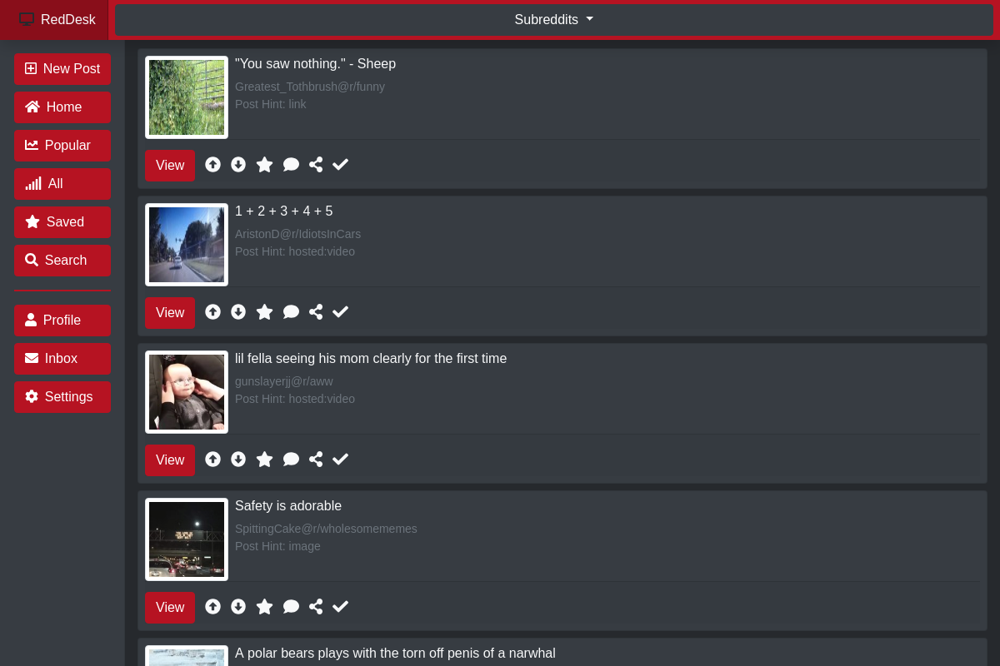
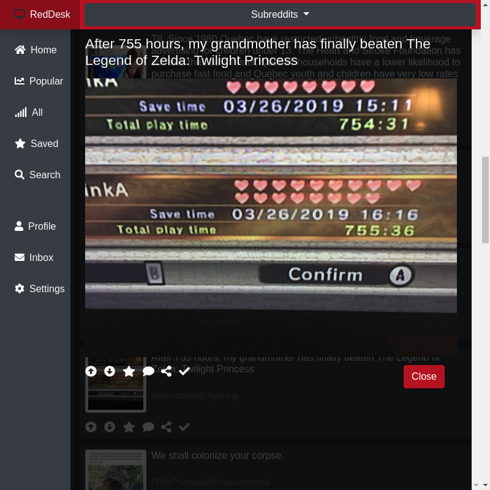

# RedDesk
RedDesk is a unofficial Reddit app built for the desktop. Built on the electron platform, it is a cross-platform, responsive application that is inteneded for everyone and anyone.




# Usage
## How to: Login (Important)
To login, since it isnt working correctly as of yet, click the "profile" button on the side panel and it will take you to the login page.

Since redirection does not work, you will have to then close the application and start it again to finish the login. It will just take you to the reddit page.

1. Open RedDesk
2. Click on "Profile"
3. Close app, and relaunch.

Posts should now come in that are for you, including your subbed subreddits.

## How to: Run

Right now, packages that are generated will need to be executed in a directory as there is no install program.

1. Download the latest release
2. Un-zip into a directory of your choosing

## Linux:

```bash
cd path_to_reddesk
./reddesk
```

## Windows:

Double click on reddesk.exe or in the command-line:
```batch
./reddesk.exe
```

# Mac: 

Double click on reddesk.app or in the terminal:
```bash
./reddesk.app
```


# Node Modules
I had to remove the node modules from the repo as electron is bigger than the max size of git. In order to install the depenancies, run the following commands in the root directory of the repo:

```bash
npm install electron
sudo npm install electron -g
```

# Build Instructions
If you want to build your own, I have setup the package to run off electron-builder.
To compile, run the following commands in the root directory of the source code:
```bash
npm run-script pack     # Packs into a directory
npm run-script dist     # Packs into applications for Mac, Windows, and Linux.
```

This will install electron globally, as well as in the app.

# Updates
```diff
+ LOGIN MOSTLY WORKING (see release for details)
+ Updated UI
+ Added new post page (not working just there)
```

# ToDo:
- Account Support
- Markdown support
- Click on expand
- HotKeys + auto scrolling
- fullscreen posts and quick post switching
- much much much more