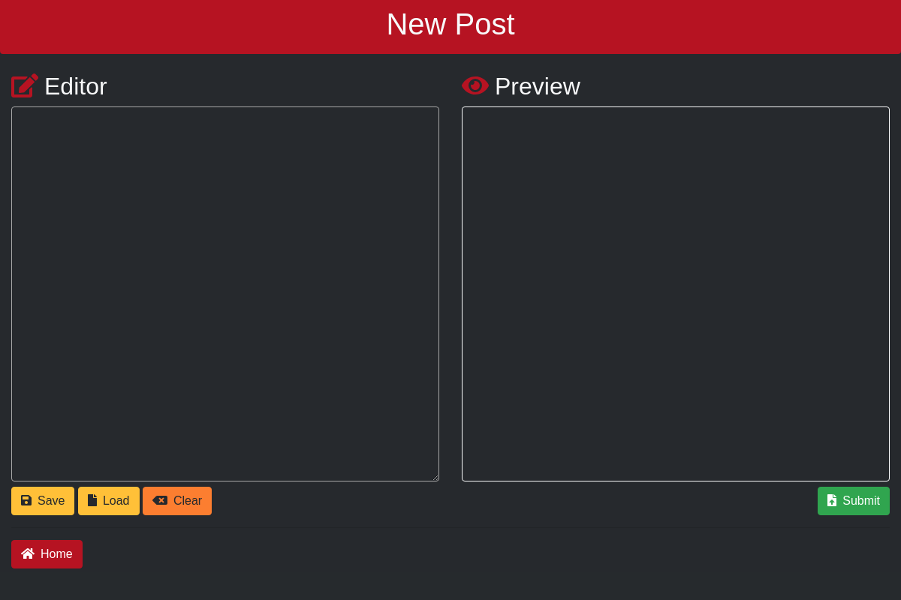

<style>
    img
    {
        width: 48%;
        margin-right: 8px;
    }
    i
    {
        color: red;
    }
</style>
<link rel="stylesheet" href="library/fontawesome/css/all.css">


# <i class="fas fa-desktop"></i> RedDesk
RedDesk is a unofficial Reddit app built for the desktop. Built on the electron platform, it is a cross-platform, responsive application that is inteneded for everyone and anyone.




# <i class="far fa-window-maximize"></i> Usage
Right now, packages that are generated will need to be executed in a directory as there is no install program.

1. Download the latest release
2. Un-zip into a directory of your choosing

## <i class="fab fa-linux"></i> Linux:

```bash
cd path_to_reddesk
./reddesk
```

## <i class="fab fa-windows"></i> Windows:

Double click on reddesk.exe or in the command-line:
```batch
./reddesk.exe
```

# <i class="fab fa-apple"></i> Mac: 

Double click on reddesk.app or in the terminal:
```bash
./reddesk.app
```


# <i class="fab fa-node-js"></i> Node Modules
I had to remove the node modules from the repo as electron is bigger than the max size of git. In order to install the depenancies, run the following commands in the root directory of the repo:

```bash
npm install electron
sudo npm install electron -g
```

# <i class="fas fa-tools"></i> Build Instructions
If you want to build your own, I have setup the package to run off electron-builder.
To compile, run the following commands in the root directory of the source code:
```bash
npm run-script pack     # Packs into a directory
npm run-script dist     # Packs into applications for Mac, Windows, and Linux.
```

This will install electron globally, as well as in the app.

# <i class="fas fa-pen"></i> Updates
```diff
+ started work on electron app
+ made a test card for the UI
- removed the node_modules for upload reasons
+ added angular.js
+ added cool image of app so far to readme (hopefully it works)
+ added config.js to turn off and on dev mode
+ Ajax working, but only on pcmasterrace and on "hot"
+ Updated UI
```

# <i class="fas fa-list"></i> ToDo:
- Account Support
- Markdown support
- Click on expand
- HotKeys + auto scrolling
- fullscreen posts and quick post switching
- much much much more